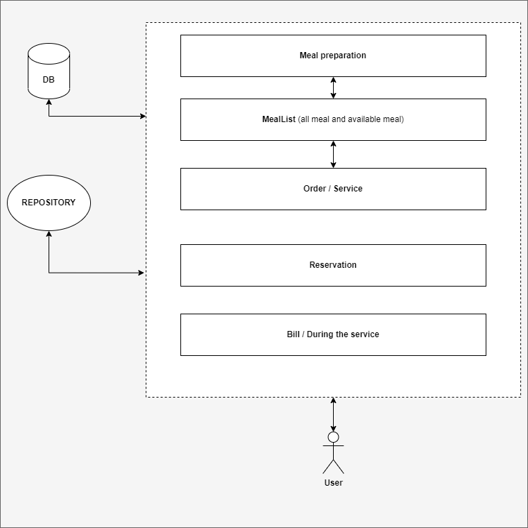

# Project Alt'Table

## Request

**Add meal (post)**
- http://localhost:3000/api/ ```mealname``` /add
- **Exemple**
  - http://localhost:3000/api/bolognaise/add

**Update meal (post)**
- http://localhost:3000/api/ ```mealname``` /```quantity```/```operation```/update
- **Exemple**
  - http://localhost:3000/api/bolognaise/15/add/update
  - http://localhost:3000/api/bolognaise/5/remove/update

**Get all meal (get)**
- http://localhost:3000/api/list

**Get available meal (get)**
- http://localhost:3000/api/list/available


## Explications

- **Monolithe : Solution court terme**


La solution court terme pour ce projet serait de faire une architecture Monolithe découpé en plusieurs middlewares, avec un seul repository et une seule base de données. Toutes les équipes travaillant sur le projet travaillerait sur ce monolithe.


- **Microservices : Solution long terme**


La solution long terme pour ce projet serait de faire une architecture en Microservices découpé en plusieurs services contenant chacun leur propres base de données, leur propre middlewares et leur propre repository. Chaque service aura sa propre équipe et potentielement sont propre language.

- **Conclusion**
Mon code est pensé pour la transition vers une architecture micro service, car j'ai déjà séparé mes middlewares en fonction des différents usage.